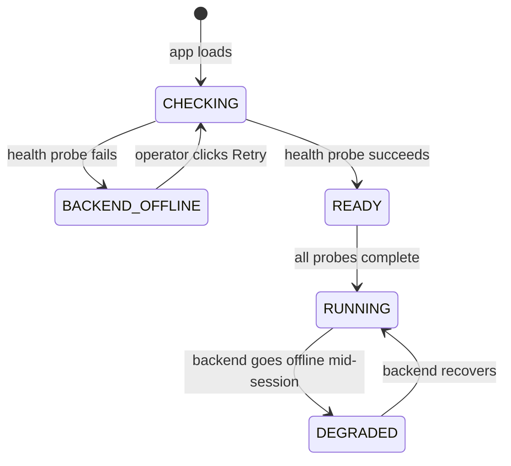
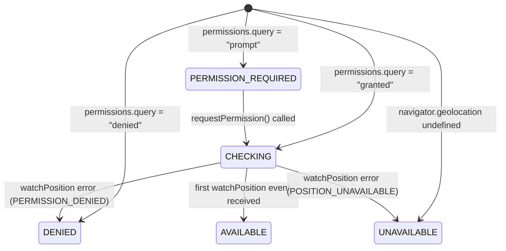

# Design Document — Aegis AI Complete

## Overview

This design covers nine completion areas for the Aegis AI local safety dashboard: startup reliability, GPS integration, emergency alert confirmation flow, configurable response destinations, structured alert message formatting, real delivery status tracking, a global system-status panel, the startup check sequence, and elimination of demo/fake data from live mode.

The stack is unchanged: FastAPI + Python + SQLite on port 8000, React 18 + TypeScript + Vite + TailwindCSS on port 5173, WebSocket at `ws://localhost:8000/ws`. All changes either extend existing files or add new files as specified; nothing is rewritten from scratch.

---

## Architecture

### High-Level Component Boundary

```
┌─────────────────────────────────────────────────────────────┐
│  Browser (port 5173)                                        │
│                                                             │
│  main.tsx                                                   │
│    └─ <StartupGate>       ← NEW wrapper component           │
│         ├─ [offline]  <BackendOfflineScreen />              │
│         ├─ [checking] <StartupLoadingScreen />              │
│         └─ [online]   <App />                               │
│                ├─ useGps()            ← NEW hook            │
│                ├─ useDashboardData()  ← extended            │
│                ├─ <SystemStatusPanel />  ← NEW              │
│                ├─ <AlertConfirmationModal />  ← NEW         │
│                └─ <AlertDestinationsPage />  ← NEW page     │
└─────────────────────────────────────────────────────────────┘

┌─────────────────────────────────────────────────────────────┐
│  FastAPI (port 8000)                                        │
│                                                             │
│  /api/health                      ← existing, unchanged     │
│  /api/alert-destinations          ← NEW endpoint            │
│  /api/alerts/{id}/dispatch        ← NEW endpoint            │
│  /api/alerts/{id}/acknowledge     ← extended (existing)     │
│                                                             │
│  alert_destinations.py            ← NEW router              │
│  alert_dispatch_service.py        ← NEW service             │
│  alert_message_service.py         ← NEW service             │
│  alert.py (model)                 ← extended                │
│  alert.py (schema)                ← extended                │
└─────────────────────────────────────────────────────────────┘
```

### Startup Gate Pattern

The `StartupGate` component (lives in `main.tsx` or a thin wrapper) runs the Startup_Check sequence before mounting `<App>`. This keeps the backend-offline guard and startup probes completely outside the main application tree, so `<App>` can assume the backend is reachable when it mounts.



---

## Components and Interfaces

### 1. `BackendOfflineScreen` — `frontend/src/components/shared/BackendOfflineScreen.tsx`

A full-viewport overlay rendered when the health check fails. No data dependencies.

```typescript
interface BackendOfflineScreenProps {
  onRetry: () => void;
  isRetrying: boolean;
}
```

Renders:
- "BACKEND OFFLINE" heading (high-contrast red)
- Explanation: "Cannot reach backend at http://localhost:8000"
- "RETRY CONNECTION" button — disabled and shows spinner while `isRetrying=true`

### 2. `useGps` — `frontend/src/hooks/useGps.ts`

Manages the GPS state machine. Exported interface:

```typescript
export type GpsStatus = 'AVAILABLE' | 'PERMISSION_REQUIRED' | 'UNAVAILABLE' | 'DENIED';

export interface GpsState {
  status: GpsStatus;
  latitude: number | null;
  longitude: number | null;
  accuracy: number | null;
  timestamp: number | null;
  requestPermission: () => void;
}
```

**State machine transitions:**



Implementation notes:
- On mount: call `navigator.permissions.query({ name: 'geolocation' })` — does not prompt
- If `granted`: immediately call `navigator.geolocation.watchPosition` and wait for first position event before setting `AVAILABLE`
- `requestPermission()`: calls `navigator.geolocation.getCurrentPosition` (triggers browser prompt), then on success starts `watchPosition`
- On every `watchPosition` position event: update lat/lon/accuracy/timestamp in state
- If `navigator.geolocation` is `undefined`: set `UNAVAILABLE`, never attempt geolocation calls
- Cleanup on unmount: call `navigator.geolocation.clearWatch(watchId)`

### 3. `SystemStatusPanel` — `frontend/src/components/shared/SystemStatusPanel.tsx`

Displays six subsystem rows. Receives all data as props so it has no async dependencies of its own.

```typescript
export type SubsystemName = 'Backend' | 'Camera' | 'WebSocket' | 'GPS' | 'AI_Engine' | 'Alert_Service';
export type SubsystemStatus = 'ONLINE' | 'OFFLINE' | 'CONNECTED' | 'DISCONNECTED' | 'AVAILABLE' |
  'PERMISSION_REQUIRED' | 'DENIED' | 'UNAVAILABLE' | 'READY' | 'LOADING' | 'CONFIGURED' | 'NOT CONFIGURED';

export interface SubsystemState {
  name: SubsystemName;
  status: SubsystemStatus;
}

interface SystemStatusPanelProps {
  subsystems: SubsystemState[];
}
```

The parent (`App.tsx`) computes each subsystem's status and passes the array down:

| Subsystem | Derivation |
|---|---|
| `Backend` | `backendOnline` from `useDashboardData` |
| `Camera` | `cameras.some(c => c.status === 'ONLINE')` |
| `WebSocket` | `wsConnected` from `useDashboardData` |
| `GPS` | `gpsState.status` from `useGps` |
| `AI_Engine` | health response `face_engine` field |
| `Alert_Service` | `destinations.some(d => d.status === 'CONFIGURED')` |

### 4. `AlertConfirmationModal` — `frontend/src/components/alerts/AlertConfirmationModal.tsx`

```typescript
interface PendingAlert {
  alertId: number;
  incidentId: number;
  incidentType: string;
  cameraName: string;
  detectedAt: string;
  confidence: number;
  severity: 'CRITICAL' | 'HIGH';
}

interface AlertConfirmationModalProps {
  alert: PendingAlert;
  gpsState: GpsState;
  destinations: AlertDestination[];
  messagePreview: string | null;
  previewError: boolean;
  onSend: (alertId: number) => void;
  onDismiss: (alertId: number) => void;
  pendingQueueCount: number;  // alerts waiting behind this one
  isSending: boolean;
}
```

Rendering rules:
- SEND button disabled when `previewError=true` or `isSending=true`
- If `gpsState.status === 'AVAILABLE'`: shows lat/lon/accuracy; else "Location unavailable"
- Destination list shows each category as "CONFIGURED" (green) or "NOT CONFIGURED" (grey)
- `pendingQueueCount > 0`: shows badge "+ {n} more pending"
- Message preview: read-only monospace textarea displaying `messagePreview`

### 5. `AlertDestinationsPage` — `frontend/src/components/settings/AlertDestinationsPage.tsx`

Admin settings view, accessible from a "Settings" nav entry. Fetches `GET /api/alert-destinations` on mount and lists all five categories with their status. No credentials displayed.

```typescript
interface AlertDestination {
  category: string;  // Medical | Fire/Rescue | Police | Disaster_Response | Local_Emergency
  status: 'CONFIGURED' | 'NOT_CONFIGURED';
  label: string;
}
```

---

## Data Models

### Alert Model Extension — `backend/app/models/alert.py`

Add four new columns to the existing `Alert` table:

```python
# New columns on the alerts table
delivery_status = Column(String, nullable=True)          # SENDING | SENT | DELIVERY_CONFIRMED | FAILED
dispatch_payload = Column(Text, nullable=True)           # JSON-serialised message sent to destination
error_reason = Column(String, nullable=True)             # error detail when delivery_status = FAILED
confirmation_at = Column(DateTime(timezone=True), nullable=True)  # when DELIVERY_CONFIRMED received
dispatched_at = Column(DateTime(timezone=True), nullable=True)    # when dispatch was initiated
```

Status flow:
```
PENDING_REVIEW → (SEND clicked) → SENDING → SENT → DELIVERY_CONFIRMED
                                          ↘ FAILED
               → (DISMISS clicked) → ACKNOWLEDGED
```

The existing `status` column keeps its current semantics (`ACTIVE`, `ACKNOWLEDGED`). The new `delivery_status` column is separate and tracks only the delivery pipeline.

### Alert Schema Extension — `backend/app/schemas/alert.py`

Extended `AlertResponse`:

```python
class AlertResponse(BaseModel):
    model_config = ConfigDict(from_attributes=True)
    id: int
    incident_id: int
    alert_type: str
    recipient: str
    status: str
    severity: Optional[str] = None
    created_at: datetime
    acknowledged_at: Optional[datetime] = None
    # New fields
    delivery_status: Optional[str] = None
    error_reason: Optional[str] = None
    dispatched_at: Optional[datetime] = None
    confirmation_at: Optional[datetime] = None
```

New schema for dispatch request (the frontend sends GPS data; backend ignores free-text message body):

```python
class AlertDispatchRequest(BaseModel):
    gps_latitude: Optional[float] = None
    gps_longitude: Optional[float] = None
    gps_accuracy: Optional[float] = None
```

### Frontend Type Extensions — `frontend/src/types/index.ts`

```typescript
// Extended Alert type
export interface Alert {
  id: number;
  incident_id: number;
  alert_type: string;
  recipient: string;
  severity: string;
  status: string;
  created_at: string;
  acknowledged_at: string | null;
  // New fields
  delivery_status: 'SENDING' | 'SENT' | 'DELIVERY_CONFIRMED' | 'FAILED' | null;
  error_reason: string | null;
  dispatched_at: string | null;
  confirmation_at: string | null;
}

// New types
export type GpsStatus = 'AVAILABLE' | 'PERMISSION_REQUIRED' | 'UNAVAILABLE' | 'DENIED';

export interface AlertDestination {
  category: string;
  status: 'CONFIGURED' | 'NOT_CONFIGURED';
  label: string;
}

// WebSocket event payloads
export interface WsAlertPending {
  alert_id: number;
  incident_id: number;
  incident_type: string;
  camera_name: string;
  detected_at: string;
  confidence: number;
  severity: 'CRITICAL' | 'HIGH';
}

export interface WsAlertStatusUpdated {
  alert_id: number;
  delivery_status: string;
  error_reason: string | null;
}
```

### Environment Variables

**Backend `.env` additions:**

```dotenv
# Alert Destinations — set endpoint URL or phone number per category.
# Leave empty or omit for NOT_CONFIGURED.
ALERT_DEST_MEDICAL=
ALERT_DEST_FIRE=
ALERT_DEST_POLICE=
ALERT_DEST_DISASTER=
ALERT_DEST_LOCAL=

# Optional API keys per destination category
ALERT_KEY_MEDICAL=
ALERT_KEY_FIRE=
ALERT_KEY_POLICE=
ALERT_KEY_DISASTER=
ALERT_KEY_LOCAL=

# Alert delivery timeout in seconds
ALERT_DISPATCH_TIMEOUT=30

# Demo/seed mode
DEMO_MODE=false
```

**Frontend `.env` addition:**

```dotenv
# Set to "true" to show DEMO MODE banner and allow simulated data
VITE_DEMO_MODE=false
```

---

## Backend API Design

### `GET /api/alert-destinations` — `backend/app/api/alert_destinations.py`

Returns the configuration status of all five destination categories. Never includes credential values.

**Response schema:**

```python
class AlertDestinationStatus(BaseModel):
    category: str     # Medical | Fire/Rescue | Police | Disaster_Response | Local_Emergency
    env_var: str      # ALERT_DEST_MEDICAL etc. — for operator reference
    status: str       # CONFIGURED | NOT_CONFIGURED
    label: str        # human-readable label

class AlertDestinationsResponse(BaseModel):
    destinations: List[AlertDestinationStatus]
    any_configured: bool
```

**Implementation:**

```python
DESTINATION_DEFS = [
    ("Medical",          "ALERT_DEST_MEDICAL",   "ALERT_KEY_MEDICAL"),
    ("Fire/Rescue",      "ALERT_DEST_FIRE",       "ALERT_KEY_FIRE"),
    ("Police",           "ALERT_DEST_POLICE",     "ALERT_KEY_POLICE"),
    ("Disaster_Response","ALERT_DEST_DISASTER",   "ALERT_KEY_DISASTER"),
    ("Local_Emergency",  "ALERT_DEST_LOCAL",      "ALERT_KEY_LOCAL"),
]

@router.get("/alert-destinations", response_model=AlertDestinationsResponse)
def get_alert_destinations():
    destinations = []
    for category, dest_var, _ in DESTINATION_DEFS:
        val = os.getenv(dest_var, "").strip()
        destinations.append(AlertDestinationStatus(
            category=category,
            env_var=dest_var,
            status="CONFIGURED" if val else "NOT_CONFIGURED",
            label=category.replace("_", " "),
        ))
    return AlertDestinationsResponse(
        destinations=destinations,
        any_configured=any(d.status == "CONFIGURED" for d in destinations),
    )
```

### `POST /api/alerts/{alert_id}/dispatch` — extension to `backend/app/api/alerts.py`

Triggers alert dispatch. The message is generated server-side from DB records; the client only supplies optional GPS coordinates.

```python
@router.post("/{alert_id}/dispatch", response_model=AlertResponse)
async def dispatch_alert(
    alert_id: int,
    payload: AlertDispatchRequest,
    background_tasks: BackgroundTasks,
    db: Session = Depends(get_db),
):
    alert = db.query(Alert).filter(Alert.id == alert_id).first()
    if alert is None:
        raise HTTPException(status_code=404, detail=f"Alert {alert_id} not found")
    if alert.delivery_status in ("SENDING", "SENT", "DELIVERY_CONFIRMED"):
        raise HTTPException(status_code=409, detail="Alert already dispatched")

    alert.delivery_status = "SENDING"
    alert.dispatched_at = datetime.now(timezone.utc)
    db.commit()
    db.refresh(alert)

    background_tasks.add_task(
        alert_dispatch_service.dispatch,
        alert_id=alert_id,
        gps_lat=payload.gps_latitude,
        gps_lon=payload.gps_longitude,
        gps_accuracy=payload.gps_accuracy,
    )
    await ws_manager.broadcast("alert_status_updated", {
        "alert_id": alert_id,
        "delivery_status": "SENDING",
        "error_reason": None,
    })
    return alert
```

### `PATCH /api/alerts/{alert_id}/acknowledge` — existing endpoint, unchanged

Already exists. The frontend calls this for DISMISS.

---

## Services

### `alert_dispatch_service.py` — `backend/app/services/alert_dispatch_service.py`

Handles external delivery. Runs as a FastAPI `BackgroundTask`.

```python
async def dispatch(
    alert_id: int,
    gps_lat: float | None,
    gps_lon: float | None,
    gps_accuracy: float | None,
) -> None:
    """
    1. Fetch alert + incident from DB.
    2. Generate message via alert_message_service.
    3. For each CONFIGURED destination, attempt HTTP POST.
    4. On success: delivery_status = SENT, broadcast alert_status_updated.
    5. On failure/timeout: delivery_status = FAILED, record error_reason, broadcast.
    """
```

Delivery logic per destination:
- Uses `httpx.AsyncClient` with a `ALERT_DISPATCH_TIMEOUT` second timeout (default 30s)
- Posts the formatted message string as the request body (content-type: text/plain) plus API key in Authorization header if `ALERT_KEY_*` is set
- On HTTP 2xx response: mark `SENT`
- On HTTP 4xx/5xx or `httpx.TimeoutException`: mark `FAILED`, store response body or exception message as `error_reason`
- Stores the final formatted message in `dispatch_payload` (JSON: `{"message": "...", "destinations_attempted": [...]}`)
- Broadcasts `alert_status_updated` WS event after each terminal state change

### `alert_message_service.py` — `backend/app/services/alert_message_service.py`

Pure formatting logic. No I/O; takes data as arguments and returns a string.

```python
def format_alert_message(
    alert: Alert,
    incident: Incident,
    camera_name: str,
    gps_lat: float | None,
    gps_lon: float | None,
    gps_accuracy: float | None,
) -> str:
    """Returns the complete AEGIS-AI EMERGENCY ALERT message string."""
```

**Message format:**

```
AEGIS-AI EMERGENCY ALERT
========================
Alert ID  : {alert.id}
Severity  : {incident.severity}
Type      : {incident.incident_type}
Camera    : {camera_name}
Detected  : {incident.detected_at.isoformat()}
Confidence: {round(incident.confidence * 100, 1)}%
Location  : {gps_string}
========================
Respond immediately. This alert was generated automatically by Aegis AI.
```

Where `gps_string` is:
- `Lat {lat:.6f}, Lon {lon:.6f}, Accuracy {accuracy:.1f}m` when GPS data provided
- `GPS: UNAVAILABLE` when GPS data is `None`

The first line is always `AEGIS-AI EMERGENCY ALERT`.

---

## Frontend Flow Designs

### Startup Check Sequence

The `StartupGate` component uses `Promise.allSettled` to fire all probes concurrently. A 10-second `AbortController` timeout wraps each individual probe.

```typescript
async function runStartupChecks(): Promise<StartupCheckResults> {
  const withTimeout = <T>(promise: Promise<T>, ms: number): Promise<T> =>
    Promise.race([
      promise,
      new Promise<never>((_, reject) =>
        setTimeout(() => reject(new Error('timeout')), ms)
      ),
    ]);

  const TIMEOUT = 10_000;

  const [healthResult, camerasResult, destinationsResult, wsResult] =
    await Promise.allSettled([
      withTimeout(fetch(`${BASE_URL}/api/health`).then(r => r.json()), TIMEOUT),
      withTimeout(getCameras(), TIMEOUT),
      withTimeout(getAlertDestinations(), TIMEOUT),
      withTimeout(probeWebSocket(WS_URL), TIMEOUT),
    ]);
  // GPS permission is synchronous (reads Permission API) — no timeout needed
  const gpsPermission = await navigator.permissions.query({ name: 'geolocation' });

  return {
    backendOnline: healthResult.status === 'fulfilled',
    healthData: healthResult.status === 'fulfilled' ? healthResult.value : null,
    camerasAvailable: camerasResult.status === 'fulfilled',
    destinationsAvailable: destinationsResult.status === 'fulfilled' ? destinationsResult.value : null,
    wsAvailable: wsResult.status === 'fulfilled',
    gpsPermission: gpsPermission.state,
  };
}
```

If `backendOnline` is `false`, `StartupGate` renders `<BackendOfflineScreen>`. Otherwise it passes the startup results down to `<App>` as initial state, avoiding duplicate fetches.

### Alert Queue in `useDashboardData`

The hook adds handling for two new WebSocket events:

```typescript
// In the ws.onmessage handler, new branches:

if (msg.type === 'alert_pending') {
  const d = msg.data as WsAlertPending;
  setAlertQueue(prev => [...prev, d]);
}

if (msg.type === 'alert_status_updated') {
  const d = msg.data as WsAlertStatusUpdated;
  setAlerts(prev => prev.map(a =>
    a.id === d.alert_id
      ? { ...a, delivery_status: d.delivery_status, error_reason: d.error_reason }
      : a
  ));
}
```

`alertQueue` is a `WsAlertPending[]` state. `App.tsx` renders `<AlertConfirmationModal>` when `alertQueue.length > 0`, showing `alertQueue[0]` and passing `alertQueue.length - 1` as `pendingQueueCount`. When an alert is sent or dismissed, the first item is removed from the queue.

### Alert Dispatch Call

```typescript
async function dispatchAlert(alertId: number, gpsState: GpsState): Promise<void> {
  const payload: AlertDispatchRequest = {
    gps_latitude: gpsState.status === 'AVAILABLE' ? gpsState.latitude : null,
    gps_longitude: gpsState.status === 'AVAILABLE' ? gpsState.longitude : null,
    gps_accuracy: gpsState.status === 'AVAILABLE' ? gpsState.accuracy : null,
  };
  await apiClient.post(`/api/alerts/${alertId}/dispatch`, payload);
}
```

### Message Preview Fetch

Before the modal displays, the frontend fetches a preview:

```typescript
// GET /api/alerts/{id}/message-preview?lat=&lon=&accuracy=
// Returns { message: string } or 4xx/5xx
```

This endpoint is a lightweight GET that generates the message without persisting anything. If the fetch fails, `previewError=true` and SEND is disabled.

### DEMO_MODE Banner

In `App.tsx`, before rendering children:

```typescript
const isDemoMode = import.meta.env.VITE_DEMO_MODE === 'true';
// ...
{isDemoMode && (
  <div className="fixed top-0 left-0 right-0 z-50 bg-amber-500 text-black text-center text-xs font-bold py-1">
    ⚠ DEMO MODE — Data is simulated
  </div>
)}
```

---

## Correctness Properties

*A property is a characteristic or behavior that should hold true across all valid executions of a system — essentially, a formal statement about what the system should do. Properties serve as the bridge between human-readable specifications and machine-verifiable correctness guarantees.*

### Property 1: Any health check failure renders the offline screen

*For any* health check response that is non-2xx, a network error, or a timeout, the `BackendOfflineScreen` component is rendered and the main dashboard layout is not rendered.

**Validates: Requirements 1.2**

---

### Property 2: Backend connection loss retains last known state

*For any* dashboard state at the time the backend becomes unreachable mid-session, the displayed data is unchanged (not blanked), and the "BACKEND CONNECTION LOST" banner is shown.

**Validates: Requirements 1.9**

---

### Property 3: GPS coordinates are only ever sourced from the Geolocation API

*For any* position event received from `navigator.geolocation.watchPosition`, the `latitude`, `longitude`, `accuracy`, and `timestamp` values stored in `GpsState` are exactly equal to the values from that event. No fabricated values are ever stored.

**Validates: Requirements 2.13, 2.14**

---

### Property 4: GPS panel renders correct UI for any status

*For any* `GpsStatus` value (`AVAILABLE`, `PERMISSION_REQUIRED`, `DENIED`, `UNAVAILABLE`), the `SystemStatusPanel` GPS row and the GPS panel render the UI elements specified for that exact status and no others.

**Validates: Requirements 2.7, 2.8, 2.10, 2.11, 2.12, 7.9**

---

### Property 5: CRITICAL/HIGH incidents always produce PENDING_REVIEW alerts

*For any* incident created with severity `CRITICAL` or `HIGH`, the backend creates an `Alert` record with `delivery_status = NULL` and `status = PENDING_REVIEW`, and broadcasts an `alert_pending` WebSocket event containing the correct incident metadata.

**Validates: Requirements 3.1**

---

### Property 6: Alert dispatch never fires before operator confirmation

*For any* `alert_pending` WebSocket event received by the Dashboard, the `POST /api/alerts/{id}/dispatch` endpoint is never called unless the operator has clicked the "SEND" button for that specific alert.

**Validates: Requirements 3.8**

---

### Property 7: Alert modal displays all required incident fields for any alert

*For any* `PendingAlert` data passed to `AlertConfirmationModal`, all five required fields — incident type, camera name, detection timestamp, AI confidence score, and severity — are rendered in the modal.

**Validates: Requirements 3.3**

---

### Property 8: Alert queue count indicator reflects pending queue size

*For any* number N of `alert_pending` events received while the modal is already open, the pending count indicator shows exactly N (the count of queued alerts behind the current one).

**Validates: Requirements 3.12**

---

### Property 9: Destination status reflects env var configuration for any combination

*For any* subset of the five destination env vars (`ALERT_DEST_MEDICAL`, `ALERT_DEST_FIRE`, `ALERT_DEST_POLICE`, `ALERT_DEST_DISASTER`, `ALERT_DEST_LOCAL`) that are set to non-empty values, `GET /api/alert-destinations` returns `CONFIGURED` for exactly those categories and `NOT_CONFIGURED` for the rest. No credential values appear in the response.

**Validates: Requirements 4.2, 4.3, 4.4, 4.5, 4.6**

---

### Property 10: Alert message always contains all required fields

*For any* `Alert`, `Incident`, camera name, and GPS state combination, the output of `alert_message_service.format_alert_message` contains: the literal header `"AEGIS-AI EMERGENCY ALERT"` as the first line, the alert ID, severity, incident type, camera name, detection timestamp in ISO 8601 format, confidence as a percentage, and either the GPS coordinates string or the literal `"GPS: UNAVAILABLE"`.

**Validates: Requirements 5.1, 5.2, 5.3, 5.4**

---

### Property 11: Backend generates message from DB records, never from client input

*For any* dispatch request body, the `dispatch_payload` stored in the database and the message sent to external destinations are derived exclusively from the `Alert` and `Incident` database records at dispatch time, not from any field in the request body.

**Validates: Requirements 5.5**

---

### Property 12: Successful delivery never falsely confirmed

*For any* delivery outcome that is not an explicit HTTP 2xx response from the destination endpoint, `delivery_status` is never set to `SENT` or `DELIVERY_CONFIRMED`. Only a genuine success response from the external endpoint may produce these states.

**Validates: Requirements 6.3, 6.5**

---

### Property 13: Failed delivery always records error reason

*For any* delivery failure (HTTP 4xx/5xx, timeout, network error), `delivery_status` becomes `FAILED`, `error_reason` is non-null, and an `alert_status_updated` WebSocket event is broadcast.

**Validates: Requirements 6.4**

---

### Property 14: Error reason display is conditional on FAILED status

*For any* alert with a `delivery_status` value, the error reason field is rendered in the `AlertsPage` if and only if `delivery_status === 'FAILED'`. For `SENDING`, `SENT`, and `DELIVERY_CONFIRMED` statuses, no error reason field is shown.

**Validates: Requirements 6.9**

---

### Property 15: System status panel derives each subsystem from real state

*For any* combination of `backendOnline`, `wsConnected`, `cameras`, `gpsState`, `healthData.face_engine`, and `destinations` values, the `SystemStatusPanel` renders each of the six subsystems with the status derived from those inputs according to the mapping table in the Components section. No hardcoded or fallback status values are used.

**Validates: Requirements 7.3, 7.4, 7.5, 7.6, 7.7, 7.8, 7.10, 7.11, 7.12, 7.13**

---

### Property 16: Non-backend startup probe failures do not block main layout

*For any* combination of non-backend Startup_Check probe failures (cameras, destinations, WebSocket, GPS), the main dashboard layout renders and each failed subsystem is shown in its corresponding error state in the System_Status_Panel.

**Validates: Requirements 8.6**

---

### Property 17: Live mode shows zeros for any empty backend response

*For any* empty (zero-length) collection returned by the backend API while `VITE_DEMO_MODE` is not `"true"`, the stat cards and dashboard counts display `0` and no placeholder or fabricated values are rendered.

**Validates: Requirements 9.2, 9.3**

---

## Error Handling

### Frontend Error Boundaries

| Scenario | Handling |
|---|---|
| Health check fails on startup | `StartupGate` → `BackendOfflineScreen` |
| Health check fails mid-session | `useDashboardData` sets `backendOnline=false`, error banner shown, last state retained |
| WebSocket disconnects | Auto-reconnect after 5s (existing logic), `wsConnected=false` shown in panel |
| Alert dispatch call fails (4xx/5xx) | Toast error shown, modal remains open for retry |
| Message preview fetch fails | `previewError=true`, SEND button disabled, error text in modal |
| GPS watchPosition error | `GpsStatus` set to `DENIED` or `UNAVAILABLE` based on error code |
| Startup probe timeout (10s) | Probe marked as failed state, does not block other probes |

### Backend Error Handling

| Scenario | Response |
|---|---|
| `POST /api/alerts/{id}/dispatch` — alert not found | 404 |
| `POST /api/alerts/{id}/dispatch` — already dispatched | 409 Conflict |
| External delivery HTTP error | `delivery_status=FAILED`, `error_reason` set to response body |
| External delivery timeout (30s) | `delivery_status=FAILED`, `error_reason="Delivery timeout after 30s"` |
| Env var not set for destination | Destination silently reported as `NOT_CONFIGURED`; excluded from dispatch |

---

## Testing Strategy

### Unit Tests

**Backend (pytest)**

- `test_alert_message_service.py` — test `format_alert_message` with known inputs, covering GPS present and absent cases, ISO timestamp format, confidence percentage rounding
- `test_alert_destinations.py` — test endpoint with mocked env vars: all configured, none configured, partial
- `test_alert_dispatch.py` — test dispatch endpoint: 404 for missing alert, 409 for already-dispatched, SENDING state set immediately, background task queued
- `test_delivery_status.py` — test `alert_dispatch_service.dispatch` with mocked httpx: success → SENT, HTTP error → FAILED + error_reason, timeout → FAILED + error_reason

**Frontend (Vitest + Testing Library)**

- `BackendOfflineScreen.test.tsx` — renders "BACKEND OFFLINE", button label, disabled state
- `useGps.test.ts` — all four permission states, watchPosition update, requestPermission call
- `AlertConfirmationModal.test.tsx` — required fields displayed, GPS conditional, SEND disabled on preview error, DISMISS calls acknowledge
- `SystemStatusPanel.test.tsx` — all six subsystem derivations
- `AlertDestinationsPage.test.tsx` — all five categories displayed with status

### Property-Based Tests

Property-based testing using **Hypothesis** (Python backend) and **fast-check** (TypeScript frontend), minimum 100 iterations per property.

**Backend (Hypothesis)**

Each test tagged: `# Feature: aegis-ai-complete, Property {N}: {text}`

- **Property 10** — `@given(alert_strategy(), incident_strategy(), camera_name_strategy(), gps_strategy())` → verify all required fields present in output of `format_alert_message`, first line is header, GPS string is correct conditional
- **Property 9** — `@given(env_config_strategy())` → for any subset of env vars set, endpoint returns CONFIGURED iff var is non-empty, no credential in response
- **Property 11** — `@given(dispatch_request_strategy())` → dispatch_payload derived from DB, not request body
- **Property 12 + 13** — `@given(delivery_outcome_strategy())` → success → SENT never from non-2xx; failure → FAILED with non-null error_reason

**Frontend (fast-check)**

- **Property 1** — `fc.oneof(networkErrorArb, nonSuccessStatusArb)` → BackendOfflineScreen rendered, main layout absent
- **Property 2** — `fc.record(dashboardStateArb)` → when backend goes offline, state is retained and banner shown
- **Property 3** — `fc.record(geolocationPositionArb)` → stored coordinates === position event values
- **Property 4** — `fc.constantFrom('AVAILABLE', 'PERMISSION_REQUIRED', 'DENIED', 'UNAVAILABLE')` → correct UI elements per status
- **Property 7** — `fc.record(pendingAlertArb)` → all five required fields rendered in modal
- **Property 14** — `fc.constantFrom('SENDING', 'SENT', 'DELIVERY_CONFIRMED', 'FAILED')` → error field iff FAILED
- **Property 15** — `fc.record(systemStateArb)` → subsystem statuses correctly derived
- **Property 17** — `fc.record(emptyCollectionArb)` → stat cards show 0

### Integration Tests

- End-to-end startup check sequence: mock all six probes, verify correct gate behavior
- Alert flow: create incident via API → verify `alert_pending` WS event → dispatch → verify delivery_status updates
- `VITE_DEMO_MODE=true`: verify banner renders in App
